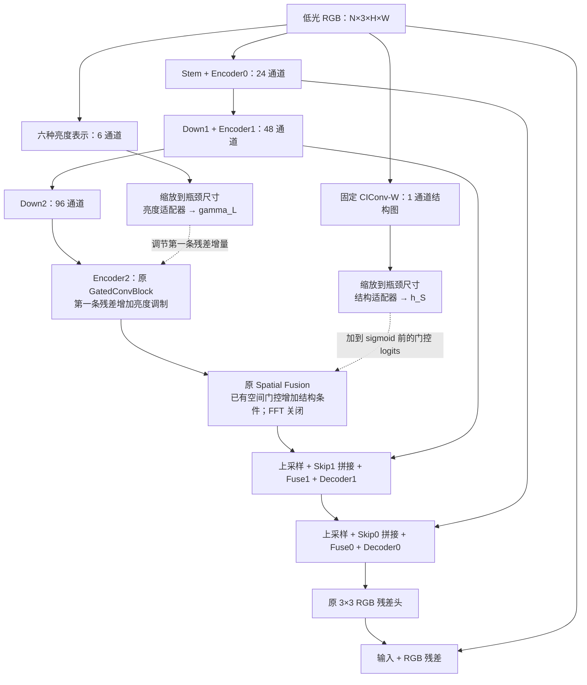

# Prior-A 实施规格：A＋亮度先验＋结构先验

日期：2026-09-24。状态：**待 Grok 实现；本文未实现模型、未启动训练。**

本轮实现一个独立候选模型 `PriorA`：保留 A 的 U 型网络和现有 Spatial Fusion，增加两条由低光输入计算的先验分支。六种亮度表示调节 `encoder2` 的第一条残差增量；CIConv-W 结构图调节现有 Spatial Fusion 的空间门控。

这里“保留 Spatial Fusion”指保留其位置、原有层、乘法融合和残差路径，只在已有 sigmoid 之前加结构条件。**不升级为完整 StarIR，不打开 FFT。** 本次检验的是两种先验的联合增量价值，不能凭这一组结果单独归因于其中一种先验。

## 1. 交付位置与工作范围

- 新项目：`M:\picture data\cholec80_t\code\cut\endo_prior_a`。本文件已经位于这里。
- 原 A：`M:\picture data\cholec80_t\code\cut\endo_enhancement_demo`，作为只读参考。
- Grok 完成模型、训练/推理入口、验证集评价入口、README、实现报告，以及下文要求的少量 CPU 合成验收。
- 本轮代码交付不启动正式训练、GPU 实验、真实图像推理或 test 评价；这些由用户后续启动。不要建立自动实验队列。
- 不改动旧模型、旧 runs、权重、数据或环境。原 A 的 `model.py` 和 `run_demo.py` 当前已有未提交修改，不要重置它们。
- 新项目运行时自包含，不动态导入其他候选项目的模型或训练器。可以复制必要的小文件并调整；不要复制旧 runs 或整个第三方仓库。

建议文件：`model.py`、`priors.py`、`run.py`、`eval_val.py`、`verify.py`、`README.md`、`IMPLEMENTATION_REPORT.md`。不需要另建通用实验框架。

## 2. 原 A 的固定定义与参考源码

```python
EnhancementDemo(width=24, output_mode="direct", spectral_mode="off", fusion_mode="gated")
```

`spectral_mode="off"` 只关闭 Fourier 滤波，**Spatial Fusion 仍存在**。不要误设为 `fusion_mode="none"` 或 `additive`。

可复核的冻结源码目录：

`M:\picture data\cholec80_t\code\cut\endo_enhancement_demo\runs\A_spatial_fusion_on_off_10k_seed100_20260924\code`

| 文件 | SHA256，2026-09-24 已核对与当前源码一致 |
| --- | --- |
| `model.py` | `f28fce7e9687ca579b27b2f0fa8bacc5cf1f99c6ca558dd0643169e432916625` |
| `run_demo.py` | `73cba915e7dc314f8217b150e726b6c3a88e6233f150f58a8691446e59fc1551` |

以这份冻结 A 为架构和训练行为的参考。可参考 `M:\picture data\cholec80_t\code\cut\endo_deep_a\run.py` 与 `eval_val.py` 的 manifest 检查及评价入口，但不要继承 Deep-A 架构或训练步数。

保留 A 的模块名称与共有参数形状，便于逐张量检查：`stem`、`encoder0/1/2`、`down1/2`、`spectral`、`fuse1/0`、`decoder1/0`、`direct_head`。新增可训练层仅为两个先验适配器。

## 3. 总体结构

输入采用 RGB、NCHW、编码值范围 `[0,1]`。本次不做线性化、预提亮或新的颜色空间主干。



对于 `H=224, W=448`，三个尺度分别为 `224×448 / 112×224 / 56×112`，宽度为 `24/48/96`。仍只有两次下采样，仍保留五个 GatedConvBlock 和瓶颈 Spatial Fusion。

先验先在原输入分辨率计算，再各自用 `F.interpolate(..., size=bottom_size, mode="bilinear", align_corners=False)` 缩放到 `down2` 输出的实际尺寸。不要先缩小 RGB 再计算非线性先验；不要硬编码除以四后的尺寸，奇数尺寸也必须可用。

两条先验分支互不拼接、互不共享适配器。所有先验只来自当前低光 RGB；训练与推理计算完全一致，GT 只用于原训练损失。

## 4. 六通道亮度先验

借鉴 Multinex 的多种亮度表示，固定顺序如下。设 `m=max(R,G,B)`、`n=min(R,G,B)`、`eps_L=1e-6`。

| 通道 | 名称 | 计算式 |
| --- | --- | --- |
| 0 | mean | `(R+G+B)/3` |
| 1 | rec709 | `0.2126*R + 0.7152*G + 0.0722*B` |
| 2 | vmax | `m` |
| 3 | lightness | `(m+n)/2` |
| 4 | ycgco | `0.25*R + 0.5*G + 0.25*B` |
| 5 | l2norm_scaled | `sqrt(R*R+G*G+B*B+eps_L)/sqrt(3)` |

本地参考：`M:\picture data\cholec80_t\train_test\Multinex\code\basicsr\models\archs\Multinex_arch.py` 中的 `IlluminationExtractor`。

与该参考相比，第六项增加 `/sqrt(3)`，目的是接近其他通道的数值尺度；必须在实现报告写明这一变化。这六项是输入亮度的不同表示，不是物理真实照明或六种独立信息。

提取在 FP32 中进行，不对单张图做 min-max、z-score 或 InstanceNorm，以保留绝对明暗差异。不加入 `Y-Blur(Y)` 或亮度比值图；这一版固定六项，不另做先验筛选。

亮度适配器，所有卷积 `bias=True`：

```text
P_L: [N,6,h,w]
  → Conv1×1(6,8) → GELU
  → DWConv3×3(8,8,padding=1,groups=8) → GELU
  → Conv1×1(8,96)
  → gamma_L = 0.5 * tanh(output)
```

于是 `1+gamma_L` 位于 `(0.5,1.5)`，与第一条残差增量逐元素相乘。这里固定 `0.5`，不再加可学习的全局强度系数。最后一层的 weight 和 bias 都置零；前面两层正常初始化。

## 5. 亮度先验接入 GatedConvBlock 的准确位置

只修改 `encoder2` 的第一条残差。设输入为 `F`：

```python
a, b = depthwise(expand(norm1(F))).chunk(2, dim=1)
Z = a * b
R = project(Z * channel_scale(Z))
F1 = F + scale1 * R * (1.0 + gamma_L)

# 第二条 FFN 残差仍按原 A 计算
c, d = ffn_in(norm2(F1)).chunk(2, dim=1)
F2 = F1 + scale2 * ffn_out(c * d)
```

`gamma_L` 的形状为 `[N,96,h,w]`，应用前与 `R` 对齐 dtype/device。原 `scale1`、`scale2` 都保留，初值仍为逐通道 `0.1`。

不要把 `Z=a*b` 当成完整残差；完整残差必须包含原 `channel_scale` 和 `project`。不要把亮度先验乘在整个 `F2`、跳接或最终 RGB 上，也不要省略第二条 FFN 残差。原 SimpleGate 是无 sigmoid 的 `a*b`，原 `channel_scale` 也没有 sigmoid。

第一版只做乘性幅度调制，不引入加性 `beta(P)`、额外残差支路或辅助损失。

## 6. 单通道结构先验：固定 CIConv-W

参考 SG-LLIE 作者仓库；2026-09-24 核对的提交为 `0b96263167b7511bede010537b64f8b44ba240a4`：

- [CIConv2d 定义](https://github.com/minyan8/imagine/blob/0b96263167b7511bede010537b64f8b44ba240a4/Enhancement/test/ciconv2d0.py)，Git blob SHA：`8594fdd7b2382d3621f608ba13f8616ea8d1283c`。
- [先验提取脚本](https://github.com/minyan8/imagine/blob/0b96263167b7511bede010537b64f8b44ba240a4/Enhancement/test/extract_prior.py)，Git blob SHA：`b72076936814d1330c37998503590c6b56f9213a`。

本版采用 **W、不采用 W_inv_3**；固定 `k=3`、`scale=0.9`，没有可学习的提取器参数。源码里的 `scale` 是指数，实际 Gaussian 标准差为 `2**0.9`，不是 `0.9`。

明确计算约定，避免实现时各自猜测：

1. 输入统一为 RGB，按下面 GCM 矩阵计算三个通道。官方离线脚本使用 `cv2.imread`，未显式做 BGR→RGB；本项目遵循现有 RGB 流程，不复制该颜色顺序。
2. GCM 矩阵为 `[[0.06,0.63,0.27], [0.30,0.04,-0.35], [0.34,-0.60,0.17]]`，作用于 `[R,G,B]`，生成 `E, El, Ell`。
3. Gaussian 和两个一阶导数滤波器沿用参考的离散定义及归一化：Gaussian 和为 1，两个导数核各自绝对值和为 1。半径 `ceil(3*2**0.9+0.5)=7`，因此核为 `15×15`；使用与参考一致的 zero padding，半径 7。滤波器仅构造一次并注册 buffer。
4. 对三个 GCM 通道分别卷积，得到平滑的 `E` 以及六个一阶导数 `Ex,Ey,Elx,Ely,Ellx,Elly`。W 中所有导数统一除以平滑后的 `E+1e-5`，再分别平方、求和：

   `W = sum((D/(E+1e-5))**2 for D in [Ex,Ey,Elx,Ely,Ellx,Elly])`

5. `L=log(W+1e-5)`；逐图、逐通道在空间维度标准化：`S=(L-mean(L))/sqrt(var(L,unbiased=False)+1e-5)`。此步骤等价于参考的无 affine、无 running statistics 的 InstanceNorm；显式写出时也应让 `H*W=1` 的退化输入保持有限。
6. 在原分辨率得到 `[N,1,H,W]` 的浮点 `S`，然后按第 3 节缩放。保留有正有负的结果，不截断到 `[0,1]`，不转 PNG/uint8，不做二值边缘。

提取全程禁用 autocast、使用 FP32；常量与核使用 buffers，随 `.to(device)` 移动，不在构造器里调用 `.cuda()`，不修改 `.data`。第一版固定提取算子，适配器可训练。保留参考源码署名和适用许可信息。

这是一版明确约定的 RGB 浮点 CIConv-W 适配，与官方 BGR 离线截断 PNG 流程有差别；不能称为逐像素复现官方先验文件。结构图提供条件信息，不构成“边缘绝不能变化”的硬约束，也不能预先声称其对内镜噪声或反光不敏感。

结构适配器与亮度适配器独立，所有卷积 `bias=True`：

```text
P_S: [N,1,h,w]
  → Conv1×1(1,8) → GELU
  → DWConv3×3(8,8,padding=1,groups=8) → GELU
  → Conv1×1(8,96)
  → h_S: [N,96,h,w]
```

最后一层 weight 和 bias 置零，其他层正常初始化。本版 `h_S` 直接作为有符号的 logit 偏置，不额外经过 sigmoid、tanh 或取绝对值。

## 7. 结构先验接入现有 Spatial Fusion

保留 `ConditionalSpectralBlock` 的 off/gated 计算路径，只改原空间门控的一行：

```python
q, v = depthwise(project_in(norm(F2))).chunk(2, dim=1)
logits = spatial_gate(v)
spatial = v * sigmoid(logits + h_S.to(dtype=logits.dtype))
fused = frequency_norm(q) * spatial
B = F2 + residual_scale * project_out(fused)
```

保留原 `norm`、`project_in`、`depthwise`、`frequency_norm`、`spatial_gate`、`project_out` 与初值 `0.1` 的 `residual_scale`；即使没有 FFT，`frequency_norm` 也仍然存在。这里不创建频域参数、CMU 或 DFFN，不改变 q 路径，不在融合结果外再乘第三个 prior gate。

## 8. 初始化、模型配置与参数量

共同主干的初始化必须与原 A 对齐。推荐先按原 A 的注册顺序构造完所有原有模块，再追加 `luma_adapter`、`structure_adapter`，避免新增卷积消耗随机数后改变后续主干初值。固定先验提取器不消耗随机数。

原 `direct_head` 的 weight/bias 仍为零；所有原残差缩放初值仍为 `0.1`。两个适配器末层置零后，`gamma_L=0`、`h_S=0`，因此在共有权重相同的条件下，内部特征路径退化为原 A。

正式实验全部从随机初始化训练，不加载原 A 的已训练权重。验收时临时拷贝共有随机权重用于比较不属于预训练。

架构标识固定 `prior_a_v1`。配置/checkpoint 至少保存：

- `width=24`、`output_mode="direct"`、`spectral_mode="off"`、`fusion_mode="gated"`；
- 亮度通道名称与顺序、`eps_L=1e-6`、L2 缩放、`gamma_limit=0.5`；
- `structure_type="ciconv_w_rgb_float_v1"`、`scale=0.9`、`k=3`、各 eps、padding/归一化约定；
- 适配器宽度 8、接入位置、resize 方式。

第一版固定两种先验同时启用，不要求额外实现自动消融矩阵。推理从 checkpoint 配置恢复，严格加载所有模型参数；不要用 `strict=False` 静默混用旧 A 的权重。训练入口对上述固定设置的冲突参数应直接报错。

按上述卷积和 bias 设置推算：亮度适配器新增 `56+80+864=1000` 个参数；结构适配器新增 `16+80+864=960` 个参数；CIConv-W 没有可训练参数。原 A 为 `206067`，新模型预计 **208027** 个可训练参数，增加 **1960（约 0.95%）**。这是结构推算，实现报告必须用实际代码计数验证。计算时间、显存和 FPS 尚未测量，不能由参数量推断。

## 9. 训练与评价接口

沿用 A 的已用设置，不同时改变训练配方：

| 项目 | 设置 |
| --- | --- |
| Python | `M:\Anaconda_envs\envs\retinexformer\python.exe` |
| 数据 | `M:\picture data\cholec80_t\train_test` |
| 配对目录 | `train/lowlight`、`train/gt`；`val/lowlight`、`val/gt` |
| 样本 | train 1500、val 200；按现有 `split_manifest.csv` 检查配对 |
| 输入 | 整图 RGB，224×448；不裁剪、增强或改尺寸 |
| 训练 | 10000 步，batch 8，seed 100，workers 0 |
| 优化器 | AdamW；lr 2e-4；weight decay 1e-4 |
| 学习率 | 原 A 的 cosine 实现，10000 步降至 min lr 2e-6 |
| 损失 | 未截断的编码 RGB 上 L1 |
| AMP / 梯度 | CUDA AMP；GradScaler 初值 1024；unscale 后 grad clip 1.0 |
| 验证 | 每 500 步，完整 val，FP32；以最低原始 val L1 选 `best_val.pt` |
| 保存 | 每 1000 步及最后一步，保留 `last.pt`、`best_val.pt`；log every 50 |

保留原采样器的每 epoch 洗牌与末尾短 batch、独立 DataLoader generator、RNG/optimizer/scaler 恢复、余弦总步数检查、输出防覆盖行为。若提供 `--stop-after`，只限制本次运行长度，不改变 10000 步学习率周期。

模型返回与输入同尺寸、未截断的 FP32 RGB；训练与 val L1 不 clamp。保存推理 PNG 时才 `clamp(0,1)`、`np.rint(x*255)`、转 uint8。验证中的浮点 PSNR 与 PNG 四指标要明确区分。

`eval_val.py` 可适配 Deep-A 入口，使用同一 `sample_id/video` manifest 和冻结的 `evaluate_four_metrics.py`（第 2 节 code 目录），输出 PSNR、SSIM、LPIPS-Alex、CIEDE2000 的逐图结果及汇总。保持原指标实现，不自行替换 SSIM、色差或 LPIPS 口径；模型训练和 `eval_val.py` 均不读取 test 图像。

下面是要求 README 提供的正式训练命令格式，**本文和 Grok 本轮不执行**。若最终 CLI 名称不同，交付时更新为真实可用命令：

```powershell
& 'M:\Anaconda_envs\envs\retinexformer\python.exe' -u -X utf8 `
  'M:\picture data\cholec80_t\code\cut\endo_prior_a\run.py' train `
  --data-root 'M:\picture data\cholec80_t\train_test' `
  --run-dir 'M:\picture data\cholec80_t\code\cut\endo_prior_a\runs\prior_a_10k_seed100' `
  --steps 10000 --batch-size 8 --seed 100 --workers 0 `
  --lr 0.0002 --lr-schedule cosine --min-lr 0.000002 `
  --weight-decay 0.0001 --grad-clip 1 --amp --device cuda `
  --val-every 500 --best-metric l1 --save-every 1000 --log-every 50
```

历史 A 比较入口为 `M:\picture data\cholec80_t\code\cut\endo_enhancement_demo\runs\ablation_10k_seed100_20260921\A_train`，其最佳权重由 val L1 选在 step 8000。保留 A 时既有 test 四指标为 `25.425066 / 0.864750 / 0.200620 / 5.093007`，移除 Spatial Fusion 时为 `25.360548 / 0.864695 / 0.206302 / 5.181987`，顺序为 PSNR/SSIM/LPIPS/CIEDE2000。数据来自已完成的单 seed 对照，不能当成本候选的结果。

本候选先看 val；test 在前期开发中已经查看过，后续报告不得称其为完全未见的最终测试集。选权重继续使用 val，不能改成 test 选模。

## 10. 必要的 CPU 合成验收

用小张量完成以下检查，不需要读取真实数据或加载历史训练 checkpoint：

1. **结构与参数。** 检查两个先验的形状、通道顺序、公式和有限性，普通 RGB、全黑、常数图均有限；检查原 A 模块仍完整、FFT 参数不存在、参数总数符合第 8 节。对亮度六通道至少用一个有已知 RGB 值的合成像素核对。
2. **共有初始化对齐。** 相同 seed 独立构建冻结原 A 和新模型，逐张量检查所有共有参数的名字、形状和值一致。只在 `verify.py` 中允许加载只读参考 A；正式训练/推理不依赖外部项目。
3. **零先验回归。** 不能只比较最终输出：A 的零输出头会掩盖内部错误。必须同时比较 `encoder2` 输出、Spatial Fusion 输出、`decoder0` 输出；还要在两个测试模型中赋予相同的非零测试 head 后比较最终输出。CPU FP32 最大绝对差目标 `<=1e-6`，记录实际值；测试用 head 不改变正式模型初始化。
4. **条件确实生效。** 在合成诊断中，分别给亮度调制和结构偏置非零值，确认影响发生在约定位置，另一条件置零；检查小张量前向、反向有限。再做少量合成优化步，确认两条适配器末层可以得到非零梯度并更新。
5. **正确理解零初始化梯度。** 正式零 head 会让最初主干梯度为零；适配器末层为零也会暂时阻断其前层梯度。这不是永久失活。可在诊断模型使用非零测试 head，再用数个优化步验证末层更新后前层也能学习；不要要求所有新增层第一次 backward 就有非零梯度。
6. **尺寸与保存恢复。** 至少验证 `32×48`、奇数 `33×49` 的输出尺寸与有限性，检查模型 checkpoint 配置和 state dict 严格保存/恢复后的前向一致。训练器恢复应保留已有机制；无需启动真实数据训练来验证文档中的接口。

CIConv 的参考一致性检查以第 6 节的 RGB 浮点约定为准：可用同一 RGB 合成输入对照官方数学实现，修正其硬编码 CUDA/设备处理；不要用官方 PNG 导出后的截断结果当浮点目标。检查不得以静默 `nan_to_num` 掩盖异常。

交付报告记录实际运行的命令、成功/失败项、参数计数和误差值；GPU AMP、训练效果、耗时/显存、真实 val/test 四指标均未执行时就写“未测”，不根据合成检查宣称模型有效。

## 11. 交付验收清单

- `PriorA` 完整实现第 3–8 节；两个先验仅使用低光输入。
- `run.py train/infer`、`eval_val.py` 可用，README 给出 CPU 检查、训练、恢复、推理与 val 评价命令。
- 原 A 的 Spatial Fusion 保留；FFT 关闭；没有完整 StarIR、额外输出头、额外 loss 或多尺度先验注入。
- CPU 验收已运行并如实记录；新旧共有初始化、中间特征与非零测试 head 的回归有明确结果。
- 保留来源信息，说明与 Multinex L2 尺度及 SG-LLIE 离线先验流程的差异。
- `IMPLEMENTATION_REPORT.md` 列出交付文件、配置、参数量、已做检查、未测项目及任何偏离本规格的地方。

完成后交回代码和实现报告，再核查并启动 **A＋两种先验** 这一组实验。完整 StarIR 与单先验消融属于后续独立实验，不混入这次实现。
