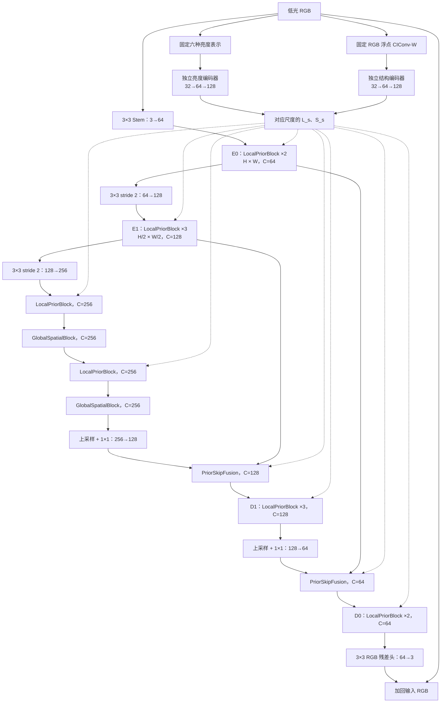

# Prior-Fusion-U3：三尺度双先验融合网络实施方案

日期：2026-09-24。版本：`prior_fusion_u3_v1`。

**交付对象：Grok。模型现已实现，参数量统计为 7,145,363。本文件于 2026-09-25 补充显存执行优化；正式训练仍需用户后续明确要求。**

显存修订保留本文件的宽度、深度和全部先验路径：残差缩放保持 AMP 激活 dtype；使用原生 LayerNorm；空间注意力 Q/K/V 保证最后一维连续；训练前向默认启用按块激活重算。参数量不能作为显存上限的替代指标，实际容量应由目标分辨率下的峰值显存约束。

本方案采用三个分辨率尺度的 U 型主干、两个独立的先验编码器，以及完整的先验融合块。主干宽度为 `64/128/256`，亮度与结构先验编码器各为 `32/64/128`。瓶颈由两个完整先验融合块与两个空间注意力块交替组成。主模型静态估算约 **7.15M** 参数，最终以代码统计为准；约 10M 是预算上限参考，不是必须达到的目标。

## 1. 工作范围与版本边界

### 1.1 本轮交付

- 新项目目录：`M:\picture data\cholec80_t\code\cut\endo_prior_fusion_u3`。
- 实现自包含的模型、先验提取、训练与推理入口、少量合成验收和简短 README。
- **实现与核查不包含启动训练。必须等用户后续明确要求，才能开始新的训练。**
- 默认验收仅使用 CPU 合成张量，执行前向、一次反向和参数统计；不创建优化器训练循环，不读取真实数据，不运行 test，不启动 GPU 性能实验或后台任务。
- 完成后简要说明交付文件、实际参数量与验收结果即可，不额外生成实现报告、核查报告或自动实验队列。
- 不修改旧候选、已有 runs、权重、数据和 Python 环境。

建议文件：

```text
endo_prior_fusion_u3/
  GROK_PRIOR_FUSION_U3_SPEC.md    # 本文件
  model.py                      # 模块、主模型、架构配置
  priors.py                     # 固定六亮度表示和 CIConv-W
  run.py                        # 显式子命令：train / infer
  eval_val.py                   # 手动验证集评价入口
  verify.py                     # 有界 CPU 合成验收，无训练循环
  README.md                     # 简短使用说明与实际参数量
```

不需要创建通用框架。模型运行时不动态导入旧候选的模型；必要的小文件可以复制并保留来源说明。

### 1.2 本方案与旧版的区别

| 项目 | 原 A / 已完成的 Prior-A | 本方案 |
| --- | --- | --- |
| 主干宽度 | `24/48/96` | `64/128/256` |
| 分辨率尺度 | 三尺度 | 三尺度，仍只有两次主干下采样 |
| 先验处理 | Prior-A 使用两个小型适配器 | 两个独立、完整的三尺度编码器 |
| Spatial Fusion | 单个旧 SF；Prior-A 在其 logits 加结构条件 | 保留 SF 核心，构成含三条残差子层的完整先验融合块 |
| 先验作用位置 | Prior-A 主要位于瓶颈附近 | 每个完整融合块及两处跳连融合 |
| 跨位置交互 | 旧 SF 以局部卷积与门控为主 | 瓶颈增加两次全图粗尺度 Key/Value 的空间注意力 |
| 重建输出 | RGB 残差 | RGB 残差 |

本方案是新的候选架构，不要求与原 A 参数形状兼容，也不要求初始化时等价于原 A。

**“完整先验融合块”不是完整复现 StarIR。** 它保留 A 的 Spatial Fusion 空间混合核心，加入亮度调制、结构交叉注意力和门控 FFN；本版不包含傅里叶分支、频域 FFN、频谱专家或路由器。不要把模块命名为 `FullStarIR`。

## 2. 固定配置

```yaml
arch_version: prior_fusion_u3_v1
input_color: RGB
input_range: [0, 1]
main_channels: [64, 128, 256]
prior_channels: [32, 64, 128]
encoder_blocks: [2, 3]
bottleneck_blocks: [local_prior, global_spatial, local_prior, global_spatial]
decoder_blocks: [3, 2]        # 从 H/2 到 H
prior_blocks_per_scale: [2, 2, 2]  # 每条先验编码器独立配置
structure_heads: [2, 4, 8]
global_heads: 8
global_kv_reduction: 4       # 相对瓶颈特征的空间尺寸
ffn_expansion: 2             # split 后每支 2C，split 前 4C
gamma_limit: 0.5
residual_scale_init: 0.1
norm_eps: 1.0e-6
conv_bias: true
dropout: 0
drop_path: 0
fft_enabled: false
aux_outputs: false
activation_checkpointing: true
luma_input_mode: real        # real 或 zero，用于后续对照
structure_input_mode: real   # real 或 zero
```

- `encoder_blocks` 不包含瓶颈，`decoder_blocks` 不包含上采样和跳连融合。
- 瓶颈一共 **4 个块，即 2 个 LocalPriorBlock + 2 个 GlobalSpatialBlock**，不是 4 对。
- 全网络共 **12 个 LocalPriorBlock、2 个 GlobalSpatialBlock**；两条先验编码器各有 6 个 PriorResBlock。
- 各模块实例独立参数；同一尺度的先验特征供多个主干块复用，编码器每次前向只计算一次。
- 不在上述块之外额外叠加原 GatedConvBlock；完整块自身已经包含 FFN。

## 3. 整体数据流和尺寸

输入 `X` 为 `[B,3,H,W]`、RGB 编码值 `[0,1]`。不做额外 gamma 预提亮、线性 RGB 转换或逐图曝光归一化。



| 位置 | 224×448 输入下的空间尺寸 | 图像通道 C | 两类先验各自通道 P |
| --- | --- | --- | --- |
| E0 / D0 | 224×448 | 64 | 32 |
| E1 / D1 | 112×224 | 128 | 64 |
| 瓶颈 | 56×112 | 256 | 128 |

所有下采样均为 `Conv3x3(stride=2,padding=1)`。奇数尺寸自然得到 `ceil(H/2)`，不强制把 RGB 改成某个固定尺寸。上采样使用对应 skip 的实际 `size`，`bilinear, align_corners=False`，随后 `Conv1x1` 降通道。

主干与两个先验编码器使用相同的下采样几何，因此对应尺度尺寸一致。不要为先验额外增加第三次下采样，也不要通过先缩小 RGB 再重新计算先验替代先验编码器。

## 4. 两种输入先验

### 4.1 六通道亮度表示

复用 `M:\picture data\cholec80_t\code\cut\endo_prior_a\priors.py` 中 `six_luminance` 的计算约定，复制到新项目。固定顺序：

| 通道 | 名称 | 公式 |
| --- | --- | --- |
| 0 | mean | `(R+G+B)/3` |
| 1 | rec709 | `0.2126R + 0.7152G + 0.0722B` |
| 2 | vmax | `max(R,G,B)` |
| 3 | lightness | `(max(R,G,B)+min(R,G,B))/2` |
| 4 | ycgco | `0.25R + 0.5G + 0.25B` |
| 5 | l2norm_scaled | `sqrt(R²+G²+B²+1e-6)/sqrt(3)` |

输出为 `[B,6,H,W]`，提取使用 FP32。不对亮度图逐图做 min-max、空间 z-score 或 InstanceNorm，以保留绝对明暗差异。这些是同一 RGB 的不同解析表示，不是独立观测，也不是已知的物理照明真值。

第一版保持这六项，不额外添加亮度比值、局部对比度或可学习颜色空间。

### 4.2 单通道结构图

复用同文件的 `CIConvW`，保留来源署名与计算约定：

- 输入 RGB 浮点数；GCM 矩阵为 `[[0.06,0.63,0.27],[0.30,0.04,-0.35],[0.34,-0.60,0.17]]`。
- `scale=0.9` 是指数，Gaussian 标准差为 `2**0.9`；`k=3`，核大小 `15×15`，zero padding。
- Gaussian 核和为 1，两个一阶导数核各自绝对值和为 1。
- 三个 GCM 通道的六个一阶导数统一除以平滑后的第一 GCM 通道 `E+1e-5`，再平方求和得到 W。
- 对 `log(W+1e-5)` 做逐图空间标准化，`unbiased=False, eps=1e-5`。
- 输出 `[B,1,H,W]`，保留正负浮点值，不裁成 `[0,1]`，不转 PNG，不二值化。
- 提取全程 FP32；常量和卷积核为 buffers，无可训练参数。

这是现有 Prior-A 的 RGB 浮点适配，不是 SG-LLIE 官方离线 BGR/PNG 流程的逐像素复现。结构图是可学习使用的条件，不是禁止模型改变边缘的硬约束，也不能预设其完全不受噪声和反光影响。

先验只读取当前低光输入。训练和推理保持同一计算过程；GT、mask、test 统计均不能进入先验生成。

## 5. 多尺度先验编码器

两个 `PriorEncoder` 的拓扑一致、权重完全独立：亮度输入通道 6，结构输入通道 1。

```text
原分辨率先验
  → Conv3×3(in_channels,32,padding=1)
  → PriorResBlock(32) ×2                    → P0
  → Conv3×3(32,64,stride=2,padding=1)
  → PriorResBlock(64) ×2                    → P1
  → Conv3×3(64,128,stride=2,padding=1)
  → PriorResBlock(128) ×2                   → P2
```

`PriorResBlock(P)` 定义：

```python
r = conv2(gelu(conv1(norm(x))))  # 两个普通 3×3，P→P，padding=1
out = x + scale * r             # scale: [1,P,1,1]，可学习，初值 0.1
```

- `norm` 为逐像素、沿通道归一化的 LayerNorm2d，有 affine 参数，`eps=1e-6`。
- 两个卷积都是普通卷积，不是 depthwise；中间一次 GELU，末尾不再加激活。
- stem、下采样卷积之后直接进入残差块，不额外插入归一化或激活。
- 保留残差恒等路径；不对整个亮度特征进行额外空间归一化。
- 先验编码器没有自己的 RGB 解码器，也没有先验真值监督损失。
- 原图先验为固定算子输出，后续编码器、投影和融合全部可训练；不得把整个 PriorEncoder 放进 `no_grad()` 或对其输出 `detach()`。

每个尺度返回 `L_s,S_s`，通道分别为 `P=C/2`。同一尺度的 encoder 与 decoder 使用同一组先验特征；每个主干块拥有独立的调制头和交叉注意力投影。

## 6. 完整先验融合块 LocalPriorBlock

接口：`forward(F, L, S)`，输入/输出图像特征均为 `[B,C,h,w]`；`L,S` 为 `[B,C/2,h,w]`。

完整块包含三条顺序执行的残差子层：

```text
F
  → LN + 亮度条件调制 + 旧 SF 空间混合核心 + 投影 + 残差
  → LN + 结构引导通道交叉注意力 + 投影 + 残差
  → LN + 门控 FFN + 残差
  → 输出
```

所有子层的 LayerNorm、投影和残差缩放均独立。每条残差使用可学习逐通道缩放 `[1,C,1,1]`，初值 0.1。

### 6.1 亮度条件调制与空间混合

亮度头保留其输入的绝对幅度，不先对 L 做空间标准化：

```python
gamma = 0.5 * tanh(gamma_out(gelu(gamma_in(L))))
# gamma_in:  Conv1x1(P,C)
# gamma_out: Conv1x1(C,C)
u = norm_sf(F) * (1 + gamma)

q, v = dw3_sf(in_sf(u)).chunk(2, dim=1)
# in_sf: Conv1x1(C,2C)
# dw3_sf: DWConv3x3(2C), padding=1

z = norm_q(q) * (v * sigmoid(dw3_gate(v)))
# norm_q: 独立 LayerNorm2d(C)
# dw3_gate: DWConv3x3(C), padding=1

F1 = F + scale_sf * out_sf(z)
# out_sf: Conv1x1(C,C)
```

这里的 SF 核心来自原 A 在 `spectral_mode=off, fusion_mode=gated` 下的计算。`norm_q` 是原代码 `frequency_norm` 的功能性更名；本版没有任何 FFT 操作。

本版亮度调制明确位于 **LN 后、SF 输入投影前**，与旧 Prior-A 调节 encoder2 残差的方式不同。不要混用旧版公式。

结构先验在下一条独立交叉注意力残差中使用；本版不同时把结构 bias 加回旧 SF 的 sigmoid logits，避免无意引入第四种先验路径。

### 6.2 结构引导的通道交叉注意力

本子层交换的是通道表示，注意力矩阵为 `d×d`；它不承担瓶颈 GlobalSpatialBlock 的跨位置值聚合功能。

```python
q = q_dw(q_proj(norm_image(F1)))
k, v = kv_dw(kv_proj(norm_structure(S))).chunk(2, dim=1)
# q_proj: Conv1x1(C,C); q_dw: DWConv3x3(C)
# kv_proj: Conv1x1(P,2C); kv_dw: DWConv3x3(2C)
```

令 `heads = 2/4/8` 对应 `C = 64/128/256`，每头通道 `d=C/heads=32`，`N=h*w`。

```python
q, k, v = reshape_to_B_heads_d_N(q, k, v)
q = normalize(q.float(), dim=-1, eps=1e-6)
k = normalize(k.float(), dim=-1, eps=1e-6)
temperature = softplus(raw_temperature)  # 每头一个，初始有效值 1
dtype = F1.dtype
scores = (q.to(dtype) @ k.to(dtype).transpose(-2, -1)).float()
A = softmax(temperature.float() * scores, dim=-1)
z = A.to(dtype) @ v.to(dtype)             # [B,heads,d,N]
z = reshape_to_B_C_h_w(z)
F2 = F1 + scale_structure * structure_out(z)
# structure_out: Conv1x1(C,C)
```

Q 来自主干，K/V 来自结构编码器。保留主干残差路径，因此结构特征提供的是附加更新，不取代图像本身的恢复特征。

### 6.3 门控 FFN

```python
u = ffn_in(norm_ffn(F2))                 # Conv1x1(C,4C)
a, b = ffn_dw(u).chunk(2, dim=1)         # DWConv3x3(4C)，两支各 2C
r = ffn_out(gelu(a) * b)                # Conv1x1(2C,C)
F3 = F2 + scale_ffn * r
```

`ffn_expansion=2` 指乘法后的隐藏宽度为 `2C`，不是把 split 前宽度写成 `2C`。本版 FFN 不含频域处理。

## 7. 瓶颈空间注意力块 GlobalSpatialBlock

接口：`forward(F)`。只放在 `H/4` 瓶颈；有两条残差：空间注意力、与第 6.3 节相同结构的门控 FFN。每个块各自参数独立。

### 7.1 完整 Query、降采样 Key/Value

```python
u = norm_attn(F)
q = q_dw(q_proj(u))
kv_size = (max(1, ceil(h / 4)), max(1, ceil(w / 4)))
u_small = adaptive_avg_pool2d(u, kv_size)
k, v = kv_dw(kv_proj(u_small)).chunk(2, dim=1)
# q_proj: C→C 的 1×1；q_dw: C 通道 3×3 depthwise
# kv_proj: C→2C 的 1×1；kv_dw: 2C 通道 3×3 depthwise
```

Q reshape 为 `[B,8,N,32]`，K/V 为 `[B,8,M,32]`；`N=h*w`，`M=kv_h*kv_w`。执行：

```python
z = scaled_dot_product_attention(q, k, v, dropout_p=0.0, is_causal=False)
# 等价于 softmax(QK^T / sqrt(32)) V，softmax 沿 M 维
z = reshape_to_B_C_h_w(z)
F1 = F + scale_attn * out_proj(z)        # out_proj: Conv1x1(C,C)
F2 = F1 + scale_ffn * GatedFFN(norm_ffn(F1))
```

优先使用 PyTorch 原生 SDPA，不增加自定义 CUDA 依赖。CPU 数值参考计算 logits 和 softmax 使用 FP32；GPU AMP 后端由 PyTorch 支持情况决定，不硬编码必须 Flash Attention。无 causal mask、无 dropout、无额外位置编码参数；Q/K/V 的 depthwise 卷积提供局部空间上下文。

对于 `224×448` 输入，瓶颈为 `56×112`，Q 有 `6272` 个位置，K/V 为 `14×28=392` 个位置。单头逻辑注意力矩阵为 `6272×392`，不是 `6272×6272`。

**每个瓶颈位置能够读取覆盖全图的粗尺度 V；这不是完整分辨率的全位置两两注意力。** 注意力内部池化 K/V 不产生新的 U 型层级；主干和输出仍在三个尺度内运行。

GlobalSpatialBlock 不再添加独立先验头：其输入已由前一个 LocalPriorBlock 注入先验。不要重复堆叠结构交叉注意力。

## 8. 先验引导的跳连融合 PriorSkipFusion

两处跳连分别使用独立模块。先将深层特征 bilinear 上采样到 skip 尺寸，再用 `Conv1x1(2C,C)` 降通道，得到 U；对应 encoder 输出为 E，二者均为 `[B,C,h,w]`。

使用独立 LN 分别处理 U、E、L、S：

```python
t = cat([norm_u(U), norm_e(E), norm_l(L), norm_s(S)], dim=1)
# C+C+P+P = 3C
logits = gate_out(gelu(gate_dw(gelu(gate_in(t)))))
# gate_in: Conv1x1(3C,C)
# gate_dw: DWConv3x3(C)
# gate_out: Conv1x1(C,C)
g = 2 * sigmoid(logits)
E_selected = E * g
F = mix(cat([U, E_selected], dim=1))     # Conv1x1(2C,C)
```

`g` 为逐通道、逐位置权重，范围 `(0,2)`，logits 接近零时约为 1。权重由两侧图像特征和两类先验共同决定；不把结构图直接当作二值保留 mask。

`mix` 后直接进入对应 decoder 的 LocalPriorBlock 序列；不要额外再加一次 U 或 E。该结构是受选择性跳连思路启发的自定义实现，不是 URWKV SSF 的逐层复现。

## 9. 输出、数值与初始化

### 9.1 主输出

```python
residual = rgb_head(D0)                 # Conv3x3(64,3,padding=1)
output = X.float() + residual.float()
```

训练 forward 不 clamp、不 sigmoid，损失在未裁剪 RGB 输出上计算。保存图片和四指标评价时采用与既有 A 一致的范围裁剪、量化和尺寸协议；不能在某个候选中偷偷改为不同协议。

### 9.2 初始化

| 参数 | 初始化 |
| --- | --- |
| 普通卷积，包括先验编码器、注意力和 FFN | PyTorch Conv2d 默认权重初始化；所有 bias 置零 |
| 全部 LayerNorm affine | weight=1，bias=0 |
| 所有逐通道残差 scale | 0.1，可学习 |
| 亮度头最后一层 `gamma_out.weight` | `normal_(0,1e-3)`，bias=0 |
| 跳连 `gate_out.weight` | `normal_(0,1e-3)`，bias=0 |
| RGB 残差头 weight | `normal_(0,1e-3)`，bias=0 |
| 结构交叉注意力温度 | `raw_temperature=log(exp(1)-1)`，经 softplus 后为 1 |

不把亮度头、结构投影、所有 residual scale 或 RGB 头同时置零。这是一个从头训练的新架构，采用小幅非零初始化，使主干和先验编码器在首次反向中即可获得梯度；小幅初始化不等于限制其训练后的表达能力。

LayerNorm2d 沿通道归一化，使用 `F.layer_norm` 原生算子：将 NCHW 转成最后一维连续的 NHWC，在禁用 autocast 的局部调用中保留输入 FP16/BF16 dtype，affine 主参数维持 FP32、调用时临时转为输入 dtype，随后转回 NCHW。原生低精度路径使用 FP32 统计累积，不展开保存多份全尺寸 FP32 中间特征。固定先验提取仍使用 FP32。

**所有残差缩放必须先将 scale 临时转为 residual.dtype，再乘残差；主参数本身保留 FP32。** 直接用形状 `[1,C,1,1]` 的 FP32 scale 乘 FP16 特征会将输出提升到 FP32，随后残差流继续维持 FP32。正确形式为 `feature + scale.to(residual.dtype) * residual`。不要调用 `model.half()` 替代 AMP。

结构交叉注意力的 Q/K 空间归一化和小型 attention logits/softmax 使用 FP32；归一化后的 Q/K 在矩阵乘法前转回激活 dtype，V 保持激活 dtype，softmax 权重乘 V 前同样转回该 dtype。空间注意力在 reshape/permute 后，对 Q/K/V 显式调用 `.contiguous()`，确保最后一维 stride 为 1，避免布局阻止融合 SDPA 后端。具体 CUDA 后端仍需在目标环境中核实。

`activation_checkpointing=true` 时，在 `model.train()` 且梯度启用的前向里，对每个主干完整块、空间注意力块、跳连融合，以及每路先验编码器的每个尺度残差序列应用 `checkpoint(..., use_reentrant=False)`。保留所需的尺度输出，反向时重算块内中间值，以额外计算换显存。eval/no_grad 自动旁路；debug 主干路径也旁路。checkpoint 不得冻结或 detach 先验。此执行选项不增加参数。

## 10. 参数与计算预算

下表按本文件逐层配置计数，包含 bias、LN affine、残差 scale 和可学习温度；固定先验 buffers 不计为可训练参数。这是**静态公式推算，不是模型实例的实测结果**。

| 部分 | 静态推算参数量 |
| --- | ---: |
| C=64 的 4 个 LocalPriorBlock | 253,448 |
| C=128 的 6 个 LocalPriorBlock | 1,423,896 |
| C=256 的 2 个 LocalPriorBlock | 1,834,000 |
| 2 个 GlobalSpatialBlock | 1,354,240 |
| 亮度先验编码器 | 870,496 |
| 结构先验编码器 | 869,056 |
| 主干两次下采样 | 369,024 |
| 两次上采样后的通道投影 | 41,152 |
| 两处 PriorSkipFusion | 126,528 |
| RGB stem | 1,792 |
| 主 RGB 残差头 | 1,731 |
| **合计** | **7,145,363，约 7.15M** |

核算公式：

- `LocalPriorBlock(C,P=C/2,heads=C/32)`：`13.5*C² + 126*C + heads`。
- `GlobalSpatialBlock(C)`：`10*C² + 85*C`。
- `PriorResBlock(P)`：`18*P² + 5*P`。
- `PriorSkipFusion(C,P=C/2)`：`6*C² + 19*C`，不含上采样前后的通道投影。

实现后用 `sum(p.numel() for p in model.parameters() if p.requires_grad)` 统计总量并按模块分组。如果不一致，先对照模块数量、FFN 展开维度、bias、norm 和投影，不通过删模块来追求某个整数参数量。约 10M 以内仍需看计算量和显存，不能用参数量推断速度。

CPU 合成验收不替代真实分辨率的 GPU 显存测量。GPU 性能核验在用户授权后单独执行；不能预先保证旧 batch size 8 可用，也不能擅自缩小网络或修改输入分辨率来适配显存。

2026-09-25 针对用户提出的显存问题，执行了一次有界 CUDA 合成前向/反向检查：224×448、物理 batch 2、FP16、激活重算开启，allocated 峰值 1,809.6 MiB、reserved 峰值 2,180 MiB，输出与参数梯度有限。未创建优化器、未更新参数、未读取真实图像、未启动训练。这个口径与原截图包含参数更新的检查不同，不能把它直接当成完整训练步的同口径降幅；Adam 两个 FP32 动量状态本身另约 54.5 MiB，更新过程还可能有临时内存。CUDA eligibility 检查显示本环境 Flash 不可用、efficient/cuDNN 可用；这不是实际调度后端的 profiler 证明。

## 11. 多尺度监督：接口预留，默认关闭

本版主损失保持单尺度 RGB L1，先比较结构本身。`aux_outputs=false` 时不创建辅助头，也不计算辅助损失。

显式启用时，在最终瓶颈输出 B3 和 D1 上分别设置 `Conv3x3(256,3)`、`Conv3x3(128,3)`：

```python
pred_quarter = area_resize(X, B3.shape[-2:]) + head_quarter(B3)
pred_half = area_resize(X, D1.shape[-2:]) + head_half(D1)
loss = L1(output, GT) + 0.25 * L1(pred_half, area_resize(GT, D1_size)) \
                         + 0.125 * L1(pred_quarter, area_resize(GT, B3_size))
```

这些辅助权重是候选默认值，不是已验证的最优值。启用辅助头增加 10,374 个参数；推理仍以主输出为准。辅助头采用与主 RGB 头相同的小幅非零初始化。是否开启是独立实验设置，写入配置和 checkpoint；实现完成不自动运行这一实验。

## 12. 对照开关与结论边界

为了比较先验输入的信息作用，保留 `luma_input_mode`、`structure_input_mode`：

- `real`：输入对应的解析先验。
- `zero`：在原始解析图进入 PriorEncoder 前，将该路输入替换为同形状零张量。
- 无论模式如何，保留先验编码器、所有交叉注意力、调制头和跳连融合，参数结构不变。
- zero 模式不允许读 RGB 作为该先验编码器的替代输入，也不允许通过别的路径传入真实先验。
- 各模式必须从头训练；不能把完整模型在推理时临时置零的结果当作训练消融。

可供用户后续选择的对照：

| 设置 | 亮度输入 | 结构输入 | 可回答的问题 |
| --- | --- | --- | --- |
| 主候选 | real | real | 新结构的整体表现 |
| 等结构无先验输入对照 | zero | zero | 保持参数结构时，图像相关先验输入的联合价值 |
| 仅亮度输入 | real | zero | 给定架构下亮度先验的作用 |
| 仅结构输入 | zero | real | 给定架构下结构先验的作用 |

zero 输入经过带 bias 的编码器仍可能形成常量或位置相关特征；这一对照移除的是**图像相关的先验输入信息**，不是删除分支。它保持参数数量，但不保证有效学习容量完全相等。若后续研究纯主干或先验表达相对 RGB 编码的价值，需要另外定义对照，不能从这四组过度推断。

与原 0.206M A 的比较用于评价整体候选，不能单独证明先验或注意力贡献。已有 test 已参与开发讨论，后续不得将其表述为从未接触的独立测试证据。

本文件只定义可用开关，不授权训练上述任何组合，不建立批量队列。

## 13. 训练、推理与 checkpoint 接口

### 13.1 模型接口

```python
model = PriorFusionU3(config)
rgb = model(x)                          # 默认返回 RGB tensor
debug = model(x, return_debug=True)      # 按需返回调制/先验等诊断信息
```

`return_debug` 至少能取得三个尺度的 `L_s/S_s`、一个 LocalPriorBlock 的 gamma、两处 skip gate。只按需暴露，不在正常前向保存全部块的大张量，不长期缓存注意力矩阵或带计算图的历史输出。

`aux_outputs=true` 的训练可经单独方法或明确的结构化返回取得辅助 RGB；默认推理接口始终返回主 RGB，避免评价器把字典当作图像。

### 13.2 数据与训练入口

- 数据根目录：`M:\picture data\cholec80_t\train_test`。
- 复用当前 `endo_prior_a/run.py` 的数据划分、配对读取、预处理、manifest 校验和采样约定；训练使用 train，选模型使用 val。
- 复制时更新 `ARCH_VERSION`、模型构造与配置保存；不要继承旧的 `width=24` 限制或 `prior_a_v1` 配置检查。
- 旧 Prior-A 固定的 10k 步、batch size 8 不自动成为新网络的正式训练预算。新 `train` 子命令要求显式提供 `--steps` 和 `--batch-size`，无参数运行只显示帮助。
- 后续同组对照统一 optimizer、LR、训练总步数、有效 batch、数据次序与 checkpoint 选择规则。可沿用现有 AdamW、RGB L1 等基础设置，完整记录所有取值。
- 若需要梯度累积，明确记录 micro-batch、累积次数和 effective batch；scheduler 按 optimizer update 计步。不能默默把 effective batch 8 改为 1。
- 不因短训练未提升就宣称充分收敛；本文件不预设必要训练时长，也不自动延长训练。
- `eval_val.py` 沿用现有四指标计算协议，读取 checkpoint 架构配置与 manifest hash。禁止读取 GT 均值对预测亮度做对齐。
- 只有显式运行 `train` 才能训练；模块 import、verify、infer、eval 均不得触发训练或创建后台训练进程。

### 13.3 checkpoint

保存完整架构配置、先验输入模式、辅助输出开关、训练配置、数据 manifest hash、模型/优化器/scheduler/AMP scaler 状态、RNG 状态与当前步数。

推理模型由 checkpoint 内的架构配置构建；与命令行冲突时明确报错。旧 A、旧 Prior-A 与本模型不允许通过 `strict=False` 静默混载。不同实验输出到独立目录，不覆盖已有训练结果。

## 14. 有界验收：确认实现，没有启动训练

实现完成后，仅做以下必要的 CPU 合成验收，打印短结果即可：

1. **形状与拓扑**：确认 12 个 LocalPriorBlock、2 个 GlobalSpatialBlock、两个各含 6 个残差块的先验编码器。对 `[1,3,32,48]` 和 `[1,3,31,47]` 前向，输出尺寸与输入一致，三个尺度匹配。
2. **边界数值**：全零、常量和随机 RGB 的解析先验及模型输出有限；结构图保留浮点正负范围，不对亮度做逐图空间归一化。
3. **真实依赖**：固定随机图像特征、只改变 L 或 S，分别验证亮度调制结果、结构交叉注意力更新确实变化。检查每个声明的输入均被使用，不能只在 debug 中返回。
4. **梯度贯通**：在默认非零初始化下，用非退化合成目标计算一次主 RGB L1 并 `backward()`；确认两条先验编码器、结构 K/V 投影、亮度头、两类主干块和跳连参数组有有限非零梯度。无需 optimizer 或 optimizer step。
5. **注意力轴**：小张量对照显式公式；结构交叉注意力沿 `d×d` 通道矩阵 softmax，空间注意力沿 `N×M` 的 M 轴 softmax。允许浮点误差，不要求不同后端逐 bit 相同。
6. **配置和参数**：real/zero 模式具有相同参数形状及数量；checkpoint 配置保存/重建后合成推理一致；打印模块级实际参数量，与第 10 节静态表对照。

CPU 验收只用小张量，检查通过即结束。GPU AMP、真实分辨率显存、速度、真实数据推理及训练都留待用户明确要求，不把“验收通过”自动接成“开始跑实验”。

## 15. 借鉴来源及本方案自己的选择

| 来源 | 借鉴内容 | 本方案的界限 |
| --- | --- | --- |
| [SG-LLIE，CVPR Workshops 2025](https://arxiv.org/html/2504.14075v1) | 结构先验、多尺度引导、结构交叉注意力 | 本方案使用自定义先验编码器、SF 残差块与注入位置，不复现其完整 HSGFE |
| [Multinex，CVPR 2026](https://arxiv.org/abs/2604.10359) | 多种解析亮度表示的学习组合 | 本方案的另一条分支是结构；Multinex 原方法还使用颜色先验，不应混称为同样的双分支 |
| [URWKV，CVPR 2025](https://arxiv.org/html/2505.23068v1) | 选择性跳连融合的设计动机 | 本方案不采用 RWKV 主干，PriorSkipFusion 是自定义的图像与先验条件融合 |
| [DarkIR，CVPR 2025](https://arxiv.org/html/2412.13443v2) | 编码/解码分工、低分辨率辅助恢复监督的思路 | 本方案保留 H/4 瓶颈，不直接复制其 Fourier 编码器与 H/8 结构 |
| 原 A：`endo_enhancement_demo/model.py` | `ConditionalSpectralBlock` 在 off/gated 下的 SF 空间混合核心 | 新版将该核心封装进完整先验融合块，非旧模块原样堆叠 |
| 现有 Prior-A：`endo_prior_a/priors.py` | 六亮度表示、RGB 浮点 CIConv-W 实现约定 | 复用固定提取器，替换旧的 8 通道适配器 |

瓶颈降采样 K/V 的空间注意力、具体宽度深度、先验编码器容量、初始化及组合方式，均为本次待验证的工程设计。文献机制不能直接证明本组合在 Cholec80 上有效，也不预先构成方法新颖性的结论。
