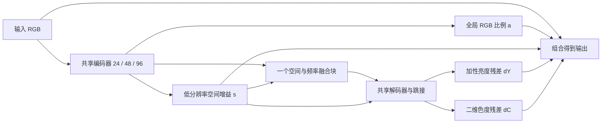

# 全局校色与局部恢复 U-Net：第一个实验 demo

这是一份独立的 PyTorch 原型。目标是用一个共享 U 型主干完成全局颜色调整、空间亮度调整及剩余细节恢复，再检查输入条件化的频域处理是否有价值。现有 Multinex、Retinexformer 和数据文件均不需要修改。

**本目录首先验证实现能否训练和推理，不代表已经获得有效的增强模型。短跑 checkpoint 不能用于宣称画质改进。**

## 设计主线



### 1. 全局颜色与空间亮度先完成基础调整

编码器最深层特征通过全局平均池化预测三个对数颜色增益 `a`，然后减去它们的均值，使 `sum(a)=0`。另一小头在 1/4 左右的分辨率预测共享空间对数增益 `s`，双线性上采样到输入大小。

```text
coarse[c,x,y] = input[c,x,y] * exp(a[c]) * exp(s[x,y])
```

`s` 允许提亮或压暗，demo 中增益范围约为 `1/32–32`。这是数值范围选择，不是数据测得的物理界限。全局颜色增益不包含共同缩放自由度。

依据来自[全局 RGB 比例诊断](../reports/retinex_global_rgb_diagnostic_20260920/README.md)：增加每图颜色比例可以吸收部分拟合误差，但不是全部。因此先给全局颜色变化一个低维表达，再保留局部修正的自由度。该诊断用了 GT；本模型所有参数都只从输入预测，二者不能等同。

### 2. 加性亮度与色度残差处理乘法调整之外的变化

共享解码器输出一个亮度残差和两个色度坐标。色度坐标投影到与 Rec.709 权重 `w=(0.2126,0.7152,0.0722)` 正交的固定二维基底，得到三通道 `dC`。

```text
output = coarse + dY * [1,1,1] + dC
w^T dC = 0
```

这样不会把全部亮度恢复限制在乘性增益上，零输入也能通过加性项产生恢复值。色度残差在裁剪之前不改变这里定义的加权亮度。保存图像时的裁剪可能破坏这一等式。

该输出表达借鉴显式颜色校正的思路，但没有移植 CSEC 的变形卷积、明暗双路或 COSE/COMO。二维色度加一维亮度本身只是 RGB 残差的坐标表达，不能单独作为贡献。

### 3. 输入条件化的空间与频率融合

只在瓶颈放一个模块：一路处理空间特征，另一路将特征分成 8×8 小块，执行 FFT、频率重加权和逆变换，再做乘法融合和残差连接。

频域响应由一组共享基础参数，加上三个可学习频率基底的逐图混合组成。混合权重由输入瓶颈特征以及预测空间增益的均值、RMS 生成。三个基底以不同频率分布初始化，但之后全部可学习，并不指定某个基底一定负责噪声、亮度或某个 RGB 通道。

这部分参考 StarIR，并将其共享静态频率参数改写成输入条件化的频率基底混合；不是原 StarIR 模块的原样复现，也尚未作完整新颖性检索。频率响应限制在 `(0.5,1.5)`，可以增强或抑制不同频率。窗口 FFT 不等于全图傅里叶处理。

FFT/逆 FFT 在 FP32 中运行。窗口不足 8 的倍数时只在瓶颈特征上 replicate padding，之后裁掉；U-Net 按跳接特征的实际大小上采样，支持奇数输入尺寸。

## 与现有观察的关系及边界

| 观察或问题 | 对应的原型选择 | 尚未证明的部分 |
| --- | --- | --- |
| 全局 RGB 比例可以解释部分配对差异 | 低维全局颜色头 | 网络是否能仅从输入准确预测这些比例 |
| Multinex 失败子集提示补偿幅度适应性问题 | 空间增益加加性亮度恢复 | 失败是否确由该机制导致，原型是否改善 |
| 全局拟合后仍有通道残差差异 | 保留空间变化的颜色残差 | 不等于 B 通道噪声，也不保证需要频域模块 |
| 全分辨率双分支训练开销 | 一个共享主干，主要复杂模块放在下采样层 | 实际训练速度、显存与画质仍需同条件测量 |

重要边界：

- 输入与损失均使用编码 RGB `[0,1]`，和现有训练接口一致；没有宣称估计物理曝光、真实照明或反射率。线性 RGB 拟合只提供结构灵感。
- `s` 与 `dY`、全局颜色与局部色度之间仍可能互相补偿。不能通过某个头的均值直接解释退化成因。
- 全部图像和像素参与训练，没有问题图筛选、特殊区域掩膜或专门的反光/配准边缘分支。普通网络 padding 不属于区域筛选。
- 不给 B 通道固定更大权重，也不把所有颜色残差当成高频噪声。
- 两个新残差头与增益头以零输出初始化，初始整网为恒等映射。第一步主要更新输出头，之后梯度才传入主干，这是预期行为。
- 初始化时三个频率基底的均值为零、路由权重均匀，因此初始滤波中性；训练后才可能形成输入相关的频率响应。

## 来源与本次改写

| 来源 | 参考的思想 | 本 demo 没有等同复现的部分 |
| --- | --- | --- |
| [NAFNet / Simple Baselines for Image Restoration](https://github.com/megvii-research/NAFNet) | 简单 U 型主干、门控卷积与通道调制 | 独立实现的小主干，层数及残差缩放初始化不同 |
| [Retinexformer](https://arxiv.org/abs/2303.06705) | 基础提亮加残差恢复、光照条件指导恢复 | 没有移植 IG-MSA；通过预测增益调制解码特征 |
| [CSEC](https://arxiv.org/abs/2405.17725) | 显式颜色偏移校正 | 没有 COSE/COMO 或变形卷积，采用固定色度基的加性残差 |
| [StarIR](https://github.com/c-yn/StarIR) | 窗口频域调制与空间乘法融合 | 增加逐图频率基底混合；没有复制整个 StarBlock/DFFN |
| Multinex 本地诊断 | 关注补偿适应性、亮色耦合和全分辨率计算成本 | 不复制全分辨率双分支，也不认定它的乘法输出是失败根因 |

各部分均为本目录独立实现；没有加载上述方法的预训练权重。

## 保留的对照开关

| 配置 | 参数 | 回答的问题 |
| --- | --- | --- |
| A：普通 RGB 残差输出 | `--output-mode direct --spectral-mode off` | 同一个共享主干的基础能力 |
| B：结构化输出 | `--output-mode structured --spectral-mode off` | 整套增益与颜色输出设计是否有帮助 |
| C：静态频域处理 | `--output-mode structured --spectral-mode static` | 在 B 上增加频域处理是否有帮助 |
| D：输入条件频域处理（默认） | `--output-mode structured --spectral-mode conditional` | 在 C 上逐图调节频率响应是否有帮助 |

`off` 保留空间乘法融合单元，只关闭 FFT 及其滤波参数，因此 A 是无频域的卷积 U 型对照，不是完全去掉瓶颈模块。B 与 A 同时改变输出表达及增益条件，不应将两者差异归因于其中一个头。条件频域版本增加了参数，以上不是参数量严格匹配的机制证明；先看有没有稳定收益，再针对有效部分细化对照。

## 文件与运行

- `model.py`：独立模型，普通调用返回未裁剪 RGB；`return_aux=True` 返回增益、残差、路由权重。
- `run_demo.py`：整图训练、可选验证、checkpoint 推理和恢复训练。
- `verify_demo.py`：有界实现检查，不评价真实数据上的增强效果。
- `requirements.txt`：最小依赖；本地已具备环境，无需重新安装。

PowerShell 中先设置：

```powershell
$demoRoot = 'M:\picture data\cholec80_t\code\cut\endo_enhancement_demo'
$demoPython = 'M:\Anaconda_envs\envs\retinexformer\python.exe'
```

检查模型：

```powershell
& $demoPython "$demoRoot\verify_demo.py" --device cpu
```

开启一个独立的 1000 步探索训练（命令供后续使用，不代表已完成）：

```powershell
& $demoPython "$demoRoot\run_demo.py" train --run-dir "$demoRoot\runs\conditional_1000" --steps 1000 --batch-size 2 --val-every 250
```

训练默认读取 `M:\picture data\cholec80_t\train_test\train\{lowlight,gt}` 的同名图像。使用完整 448×224 图像，避免全局颜色头只看到裁剪块；不做 resize、增强、GT 均值修正。配方为 AdamW、学习率 2e-4、L1、梯度裁剪 1、CUDA AMP；这是 demo 配方，不宣称与现有 baseline 同协议。

默认 `--val-every 0` 不跑验证。设置为正数后使用完整 val，保存验证 L1 最低的 `best_val.pt`。验证 PSNR 为 clamp 后 RGB float PSNR，不能直接与已有 PNG 测试表混用；不读取 test。

恢复训练示例：

```powershell
& $demoPython "$demoRoot\run_demo.py" train --run-dir "$demoRoot\runs\conditional_1000" --resume "$demoRoot\runs\conditional_1000\last.pt" --steps 2000 --batch-size 2 --val-every 250
```

非默认的模型/训练设置在恢复时需要重复传入，脚本检查一致性。恢复保存优化器、scaler、RNG 和 shuffle 的 epoch/batch 位置；不承诺不同 CUDA 后端环境下位级一致。

对验证集输入目录推理（也可把 `--input` 换成一张图；需要已经训练的 checkpoint）：

```powershell
& $demoPython "$demoRoot\run_demo.py" infer --checkpoint "$demoRoot\runs\conditional_1000\best_val.pt" --input 'M:\picture data\cholec80_t\train_test\val\lowlight' --output-dir "$demoRoot\predictions\conditional_1000"
```

推理不接收 GT；只在保存 PNG 时 clamp 到 `[0,1]` 并四舍五入量化。脚本拒绝覆盖已有输出。

## 初次检查记录

2026-09-21 的实现检查：

- 默认模型可训练参数 **223,024**，即约 **0.223M**。
- CPU 合成检查通过：6 种结构/频域开关组合、共 12 个尺寸检查（含奇数和 1×1）、恒等初始化、3 步反向传播及主干梯度、序列化往返、输出不强制 clamp。
- 合成检查确认全局对数颜色增益之和接近零、色度残差的加权亮度接近零。独立改变路由参数后，不同输入条件能改变不同频率的相对响应；这验证实现能力，不表示模型已经学到该行为。
- 默认结构以真实训练图像的完整 448×224 尺寸、batch 2、CUDA AMP 跑了 3 步，再从 checkpoint 恢复到第 4 步；loss 和梯度有限，4 步均未发生 AMP 跳步。
- 加载第 4 步 checkpoint 完成一张训练输入的 PNG 推理检查。输出仅用于检查保存链路，不是画质展示。
- 这轮没有运行完整 val/test 评估，没有完成正式训练，也没有得出与 baseline 的效果或速度比较。

短跑记录位于 `runs/smoke_default/`；不要将其 `last.pt` 当成已训练的增强权重。CUDA 初始 AMP scale 为 1024；若后续训练出现有限 loss 下的梯度溢出，允许 GradScaler 降 scale 并记录跳步，FP32 非有限梯度仍报错。

## 300 步探索结果

按用户要求，从第 4 步继续至第 300 步，新运行 296 步。结果保存在 `runs/demo_300/`，没有覆盖原来的短跑 checkpoint。

- 训练正常完成，本段 AMP 跳步为 0。
- 完整 val 200 张：clamp 后 RGB float PSNR **23.8743 dB**；未 clamp 输出的 L1 **0.05817**。这是训练验证口径，未计算完整 PNG benchmark 指标。
- [输入 / Demo / GT 组图](runs/demo_300/comparison_300.png)展示四个按验证视频顺序预先固定的样例，不按输出效果筛选。
- 这四张组图中，输出有所提亮，但较暗样例仍欠亮、暗区发灰，并可见块状痕迹；尚未检查这些痕迹的来源。
- 权重为 `runs/demo_300/last.pt`，摘要为 `runs/demo_300/result_300.json`。本次训练止于 300 步，没有运行 test。

## 10,000 步训练（2026-09-21）

运行目录为 `runs/demo_10k_bs8_cos_20260921/`。本轮从随机初始化开始，batch 8、完整 448×224 图像、AdamW、L1、AMP，其余网络设置保持默认。学习率在第 1 步为 2e-4，按余弦衰减，在第 10,000 步为 2e-6；没有 warmup。前 3 步用于确认 batch 8 的显存和 checkpoint，随后恢复同一训练状态继续至 10,000 步。

每 500 步验证全部 200 对验证图像，按验证 L1 保存 `best_val.pt`。每 1,000 步另存 `step_001000.pt` 等独立 checkpoint；`last.pt` 在定期保存、验证改善或运行结束时更新。权重包含优化器、AMP scaler、RNG 和训练配置。`status.json` 记录当前进度，逐步记录在 `loss.jsonl`，启动后的输出在 `stdout.log` / `stderr.log`。

恢复本轮时需保留 `--steps 10000 --batch-size 8 --lr 0.0002 --lr-schedule cosine --min-lr 0.000002 --val-every 500 --save-every 1000 --log-every 50 --device cuda`，并指定本轮目录和 `--resume` checkpoint；余弦周期不会因恢复而重置。默认 constant 调度仍兼容原 300 步 demo。不要在同一目录同时启动第二个训练进程。

## 自动消融队列（2026-09-21）

运行 `start_ablation_queue.ps1` 在后台启动或恢复 `run_ablation_queue.py`。结果在 `runs/ablation_10k_seed100_20260921/`。队列锁会阻止重复启动；每个阶段有独立日志，失败后最多自动重试一次，保留错误记录和可恢复权重。

队列先用已有 D 的最佳验证 L1 权重补齐 200 对验证集四指标，再自动依次完成 A（direct/off）、B（structured/off）、C（structured/static）各 10,000 步训练及最佳验证权重的四指标评估。三轮统一 batch 8、seed 100、整图、AdamW、L1、2e-4 至 2e-6 余弦衰减；每 500 步验证，每 1,000 步保留独立权重。D 不重新训练，本队列不追加测试集评估。

`queue_status.json` 记录当前组、阶段和进程，`logs/` 记录每组训练、推理和指标计算。每完成一组，`COMPARISON.md` 与 `comparison.csv` 自动更新。用于执行的模型、训练和评估代码保存在队列的 `code/` 快照，哈希与共同配置记在 `queue_contract.json`。检查队列时同时读取各训练目录的 `status.json` / `loss.jsonl`，其中的步数比队列阶段记录更细。
