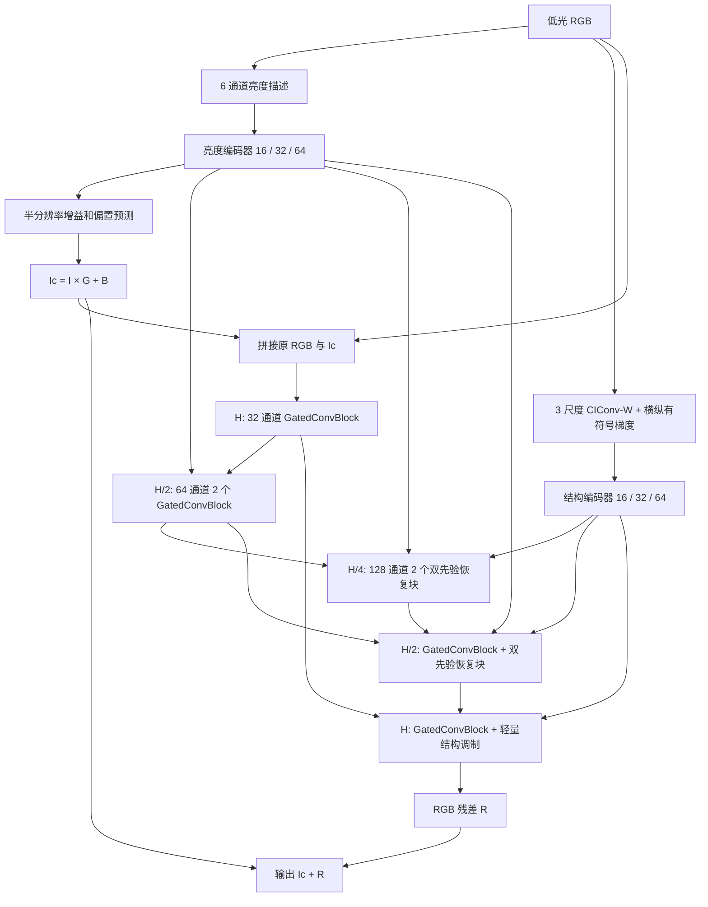

# Prior-A v2

以 A 的 GatedConvBlock 为基础，加入显式亮度校正和多尺度结构引导的三分辨率 U-Net。架构版本 `endo_prior_a_v2_1`，可训练参数 **1,271,689**。验证实现可运行不代表已经获得增强效果提升；本目录尚未进行正式训练。

## 结构



- 主干宽度 `32/64/128`，两条独立先验编码器宽度均为 `16/32/64`，每尺度 `1/2/2` 个双卷积残差块。
- 亮度输入为均值、Rec.709 加权 RGB、最大通道、最大最小均值、YCoCg 亮度、归一化 L2，共 6 通道。这些是编码 RGB 上的亮度描述，不是物理照度测量。
- `G = exp(log(8) * tanh(g))`、`B = 0.1 * tanh(b)`。半分辨率预测经过插值形成单通道校正图，广播到 RGB。`G` 范围为 `[1/8,8]`，`B` 范围为 `[-0.1,0.1]`。校正头零初始化，初始 `Ic=I`；最终残差头也零初始化。
- 结构输入为 `sigma=1, 2**0.9, 3` 的固定 CIConv-W 和 `sigma=0.9` 高斯导数的横纵梯度。梯度的两个方向共享每图绝对值 95% 分位尺度，分母下限 `0.03`，随后使用 `tanh` 限幅。该下限是当前设计值，目的是避免把很弱的暗区噪声拉成强响应；不保证结构图能自动排除全部噪声。
- 两路固定先验均在数据增强后从低光输入计算；GT 仅用于损失。
- 双先验恢复块包含局部 GatedConvBlock、动态 3×3 聚合和 FFN。主特征与结构特征共同预测 9 个邻域权重，沿邻域维做 softmax；半分辨率 4 组、瓶颈 8 组共享核。聚合值来自经过亮度调制的主特征。
- 动态聚合的输出投影零初始化，保留初始残差恒等路径；权重预测层正常初始化，避免多个串联零输出层延迟学习。整个恢复块仍包含可学习局部卷积和 FFN。
- 采用 9 个平移视图聚合和 activation checkpointing，避免大尺寸逐通道 `unfold`。全分辨率末端使用轻量结构调制。没有 FFT 或全图空间注意力。

## 默认训练设置

| 项目 | 配置 |
|---|---|
| 数据 | 原 manifest：train 1500 / val 200 / test 300 |
| 训练输入 | 成对 `192×384` 随机裁剪；水平、垂直翻转各 0.5 |
| 验证 / test | 完整尺寸、无增强、FP32 推理 |
| Batch / seed | 4 / 100 |
| 优化器 | AdamW，weight decay `1e-4`，梯度裁剪 1 |
| 学习率 | cosine `2e-4 → 2e-6` |
| 训练长度 | 40 epoch，当前 batch 下每 epoch 375 步，共 15,000 步 |
| 验证 / 保存 | 每 1,000 步；结束时也保存 |
| 最佳模型 | 最小最终输出 raw RGB L1；同时报告 clamped RGB float PSNR |
| AMP / workers | FP16 AMP / 0 |

损失为：

```text
L = L1(output, GT) + 0.1 × L1(Down4(Y(Ic)), Down4(Y(GT)))
Y = Rec.709 加权 RGB，Down4 = area 下采样
```

训练损失前不截断输出，不做 GT 均值校正。分别记录 `loss_main` 和未乘 0.1 的 `loss_aux`。辅助损失监督亮度校正图，不是旧 U3 的多尺度 RGB 解码器损失。

## 使用

在 `M:\picture data\cholec80_t\code\cut` 执行以下 PowerShell 命令。直接运行模块而不指定子命令只显示帮助。

```powershell
$py = 'M:\Anaconda_envs\envs\retinexformer\python.exe'

# CPU 检查；加 --gpu-smoke 会做有限更新和一次恢复对照，不创建正式 run。
& $py -m endo_prior_a_v2.run verify --gpu-smoke --gpu-steps 4

# 以下命令才会开始正式训练，需要用户明确要求后执行。
& $py -m endo_prior_a_v2.run train

# 依照 checkpoint 保存的全部设置恢复。
& $py -m endo_prior_a_v2.run resume --checkpoint 'endo_prior_a_v2\runs\prior_a_v2_seed100\last.pt'

# 正式训练后评估；默认 val，可明确指定 --split test。
& $py -m endo_prior_a_v2.run eval --checkpoint 'endo_prior_a_v2\runs\prior_a_v2_seed100\best_val.pt'
```

新运行只能写入本目录的 `runs/` 子目录。架构、数据 manifest、增强、优化器、学习率跨度等设置在恢复时严格检查；增强按 seed、epoch、sample 确定，恢复采样位置后不改变后续裁剪/翻转。保存 model、optimizer、AMP scaler、步数、随机数状态与采样状态。

需要安全暂停时，在对应 run 内创建 `STOP_REQUESTED` 文件；训练会在当前步结束后保存 `last.pt` 并退出。恢复前明确移除该文件。`--stop-after N` 可限定本次额外运行步数，不改变原学习率总跨度。

检查结果写入 `checks/verification_gpu.json` 或 `checks/verification_cpu.json`。GPU 检查使用真实训练样本；`--gpu-steps 4` 为 4 个逻辑步加 1 个恢复重复步，共 5 次 optimizer 更新，只验证可运行性。单张完整 val 图仅检查验证入口，不构成质量评估。

2026-09-26 在 RTX 5070 Ti Laptop 12 GB、PyTorch 2.8.0+cu128 上通过上述检查：峰值已分配 **952 MiB**、峰值缓存保留 **1,356 MiB**，均为 PyTorch 统计，不包含驱动等全部显存。预热后单次更新约 **0.13–0.15 秒**，包含梯度诊断，不含批次读盘，不能直接作为整段训练耗时。AMP 使用默认初始 loss scale 65,536；检查中没有跳步，两路先验、深层结构分支与动态权重分支均出现有限非零梯度。恢复对照最大参数差为 `7.45e-8`。正式训练尚未启动。
